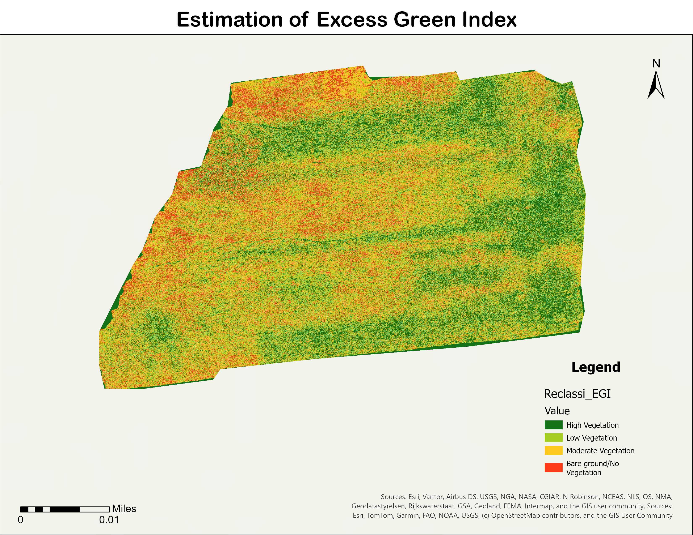
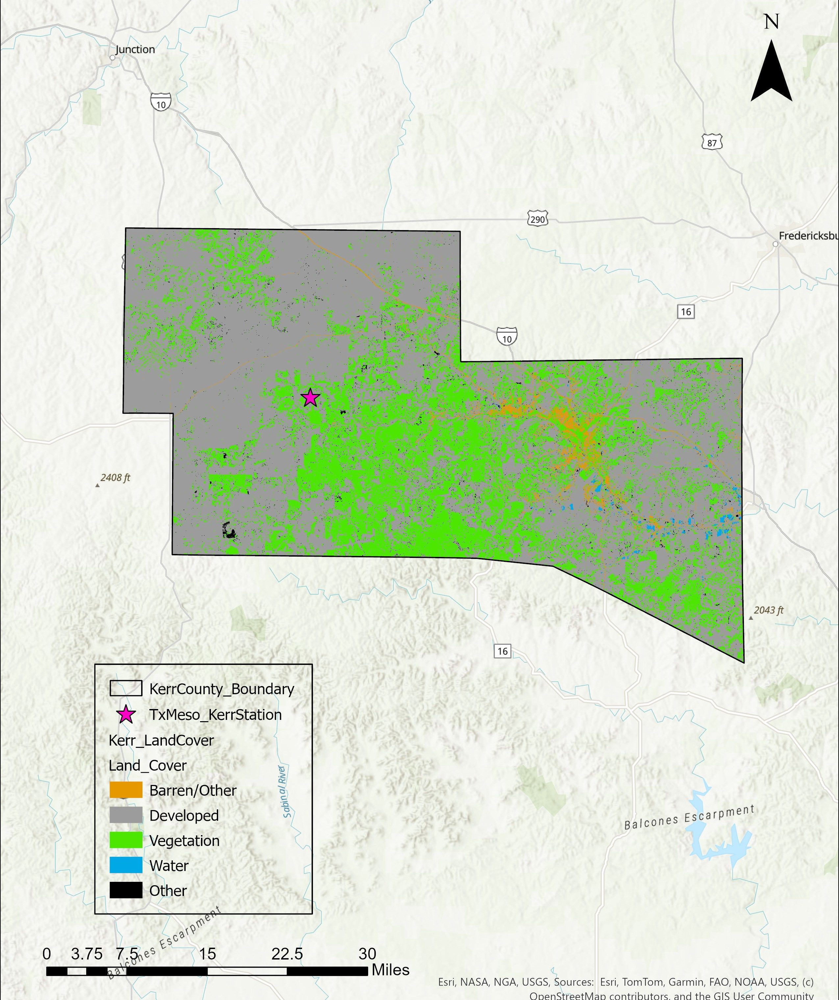

# Rashmi Dangol
I am Rashmi Dangol, a research assistant at Texas A&M University, where I work on sensor-based detection of weed species in rangelands. My projects focus on remote sensing, including UAV and satellite data, as well as the development of computer vision and machine learning approaches, contributing to sustainable rangeland management. I am skilled in  acquiring, processing, analyzing, and visualizing spatial data to provide meaningful insights that help industries make informed and impactful decisions.

#### Technical Skills: Python, ArcGIS Pro, Pix4DMapper, SAS, Microsoft Office

## Education
- Graduate Certificate in GIS | Texas A&M University, College Station, TX (_December 2025_)

- M.S., Agriscience | Illinois State University, Normal, IL (_May 2024_)

- B.S. Agriscience | Agriculture and Forestry University, Nepal (_September 2019_)

## Work Experience
**Research Assistant**
- Conducted GIS and Remote Sensing-based research experiments for precision agriculture and utilized satellite imagery and remote sensing software to evaluate forest and pasture lands
- Developed and trained a computer vision model (YOLO) for the automated detection of weed species in pastures using proximal imaging

**Product Placement Phenotyping Intern @ Syngenta**
- Created geospatial field maps, led flight operations, and analyzed high-resolution aerial images using a DJI Matrice 300 RTK drone for corn emergence
- Developing a machine-learning-based image processing pipeline and analyzing data to have the first model estimators using Python

**Seed Technology Intern @ Bayer**
- Coordinated data collection for soil testing and analysis using the Smart Farm Plus application and created Latin America (LATAM) seeds technical sheets

**Digital Enumerator/Surveyor @ International Maize and Wheat Improvement Center (CIMMYT)**
- Led a team of six members to conduct baseline and end-line surveys using Kobo_Toolbox for the Beneficiary-Based Survey of the National Seed and Fertilizer Project (NSAF) to understand the effectiveness of ICT tools in agriculture in Nepal

## Projects
### Weed Recognition with Deep Learning Approaches
Developed and evaluated a deep learning-based weed identification system for recognizing six common and invasive weed species in pastureland in digital images.
### Technical Approach
**Detection and Segmentation Model**: Comparing the performance of various deep learning architectures:
- YOLOv8 (You Only Look Once, version 8)
- YOLOv11 (You Only Look Once, version 11)
- RT-DETR (Real-Time Detection Transformer)

### Remote Sensing-based Classification in Pastureland 
Monitored the spatial distribution of weeds and implemented classification models for weed mapping

Vegetative Indices such as Excess Green Index (ExG) and Normalized Green-Red Difference Index (NGRDI) were calculated, and a Support Vector Machine model was chosen for classification in ArcGIS Pro.

### Excess Green Index (EGI) Map

  
   
  <em>Highlights vegetation using RGB-based index derived from drone imagery</em>

### Classification Map- Support Vector Machine (SVM)

### Flood Analysis through Soil and Satellite Data in Kerr County, TX
Analyzed flood dynamics by integrating satellite data, land cover, and soil moisture data.
[Publication](https://rashmidangol.github.io/flood_analysis_Kerr_county/)

The study used multiple datasets from TexMesonet, including time-series measurements of soil moisture at several depths (5 cm, 10 cm, 20 cm, 50 cm), satellite-derived NDWI (Normalized Difference Water Index) from Sentinel-2, and land cover (National Land Cover Database). The analysis was conducted using ArcGIS Pro and Python, utilizing a combination of remote sensing, GIS, and time-series data to understand flood dynamics and land cover influence in Kerr County. The results found that soil moisture at 50 cm depth rose from 17% to over 50% in a single day. From land cover area analysis, nearly half of all the water detected by NDWI (moderate and flooded) was from urban or developed surfaces. The Developed and Vegetation classes were the most significantly affected in terms of area, accounting for 46.7% and 39.3% of the total flooded landscape, respectively.

### Land Cover Classes in Kerr County

  
   
  <em>Land Cover Distribution</em>

